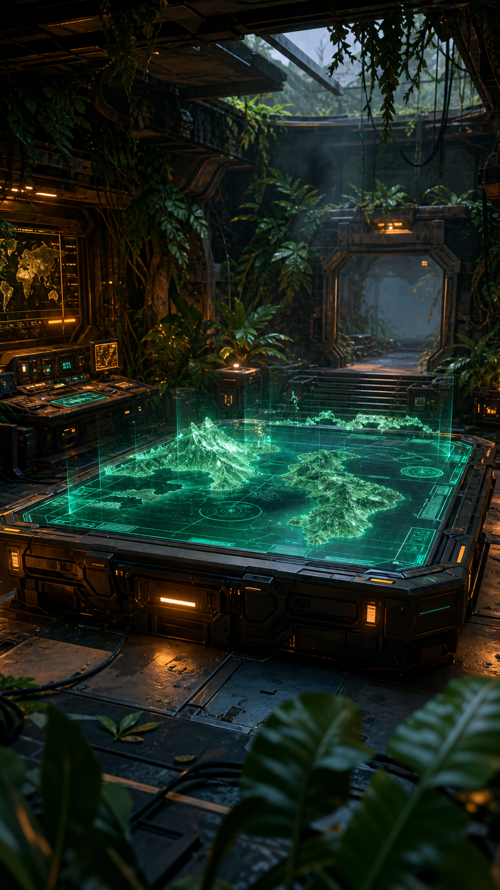

# RYZ WAR ROOM

A redesign of the **RyZ s129 Alliance Tracker** (Last War: Survival) as a unified,
mobile-first military command center — one scrolling console instead of tabs, with an
interactive three.js holographic theatre, animated power readouts, roster dossiers with
rank insignia, squad loadouts, and a supply-draw wheel. Installable as a PWA (offline
shell via service worker).



## What's in the box

```
server.mjs          Zero-dependency Node server: static host + demo API fixtures + optional proxy
site/               The app (plain HTML/CSS/JS — no build step)
  index.html        War Room shell
  app.js            All app logic (three.js holo globe, charts, roster, draw wheel)
  app.css           Theme (Season 6 "Lost Rainforest": gunmetal / jungle / holo-teal / amber)
  sw.js             Service worker (offline shell, network-first API)
  manifest.webmanifest  PWA manifest
  vendor/three.module.min.js   three.js r160, self-hosted
  fonts/            Black Ops One + Rajdhani (woff2, self-hosted)
  art/              Emblem + hero backdrop (generated, optimized)
  legacy.html       The original tabbed UI, kept for reference
Dockerfile
compose.yaml
```

No npm install, no build step, no external network calls at runtime — everything is
self-hosted so the PWA works offline.

## Run it with Docker

```bash
docker compose up -d
# → http://localhost:5129
```

Or without compose:

```bash
docker build -t ryz-warroom .
docker run -d -p 5129:5129 --name warroom ryz-warroom
```

Out of the box it serves **built-in demo fixtures** — a snapshot of the alliance data
(members, powers, growth) hardcoded in `server.mjs`. Log in with any callsign; you get
an R5 view so every module is visible.

## Connect your real data

The frontend talks to `/api/*` only. Two ways to wire it to the real backend:

### Option A — proxy mode (quickest)

Point the container at your existing backend with `API_ORIGIN`. The server forwards
every `/api/*` request (method, JSON body, and `Authorization` header) upstream and
returns the response untouched:

```yaml
# compose.yaml
services:
  warroom:
    build: .
    ports: ["5129:5129"]
    environment:
      API_ORIGIN: "http://your-backend:3000"   # or https://ryz129.tcilan.website
```

Auth then flows through your real `/api/auth/login` — the demo "any callsign works"
behavior disappears and your real user roles apply.

> Note: if you proxy to the production site and it sits behind Cloudflare's bot
> challenge, server-to-server calls may get 403s. Point at the origin/backend service
> directly (e.g. the backend container on the same Docker network) instead of the
> public hostname.

### Option B — serve the frontend from your own backend

The app is static files. Have your existing server serve the contents of `site/` and
keep your `/api` routes on the same origin — delete `server.mjs` entirely. The only
contract is the API below.

### API contract the frontend expects

| Endpoint | Method | Used for | Response shape (fields actually read) |
|---|---|---|---|
| `/api/auth/login` | POST `{username}` | Login gate | `{token, user}` |
| `/api/auth/me` | GET (Bearer) | Session restore | user object `{id, username, role}` |
| `/api/alliance` | GET | Hero, divisions, roster | `{name, slogan, totalPower, aSquadPower, memberCount, typeDistribution, topPerType, members[]}` — members carry `{username, role, primary_type, play_level, vac_start, vac_end, total_power, a_squad_power}` |
| `/api/alliance/growth` | GET | Trajectory chart | `[{snapshot_date, Tank, Missile, Aircraft, total_power}]` |
| `/api/squads` | GET | Loadout module | `[{label, unit_type, total_power, is_active}]` (labels A–D) |
| `/api/draw/spin` | POST `{squad,min,max}` | Supply draw | `{winner: {username}}` |

These are the same routes the original Alliance Tracker backend already serves, so
proxy mode should be plug-and-play.

## Configuration

| Env var | Default | Meaning |
|---|---|---|
| `PORT` | `5129` | Listen port |
| `API_ORIGIN` | *(empty)* | If set, proxy `/api/*` to this origin; if empty, serve demo fixtures |

## Run without Docker

```bash
node server.mjs                       # demo fixtures on :5129
API_ORIGIN=http://localhost:3000 node server.mjs   # proxy mode
```

Requires Node 18+ (uses global `fetch`).

## PWA install

On a phone, open the site → browser menu → **Add to Home Screen**. The shell (HTML,
CSS, JS, fonts, art) is cached by the service worker; API data is network-first with a
cached fallback, so the last-seen dashboard still opens offline.

After deploying a new version, bump the `CACHE` name in `site/sw.js` (e.g.
`warroom-v3`) so returning clients pick up the new shell.

## Notes

- **HTTPS matters for the PWA** — service workers require a secure context (localhost
  is exempt). Behind Cloudflare or any TLS-terminating proxy you're fine.
- The three.js dome is drag-to-rotate; radar blips and the sweep are decorative.
- `site/legacy.html` is the original tabbed UI, untouched, if you want to compare.
- Original design and data: the RyZ s129 alliance tracker at ryz129.tcilan.website.
